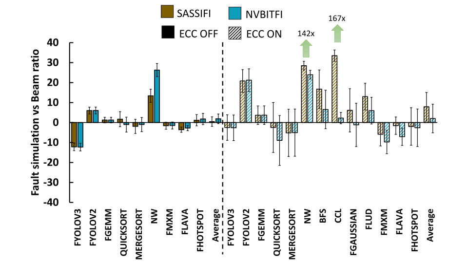
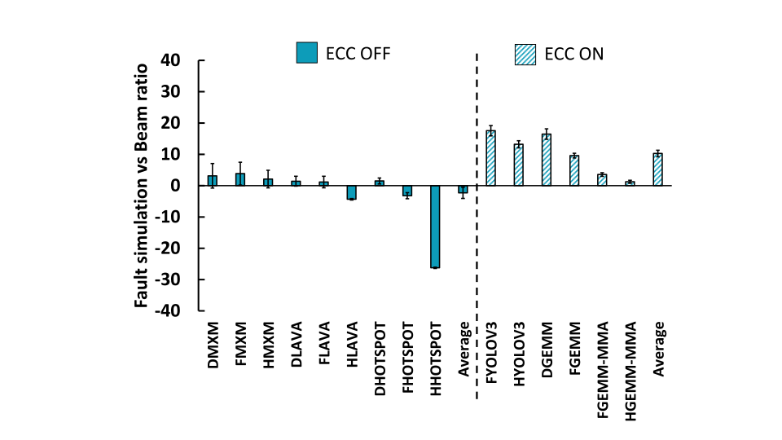

# Demystifying GPU Reliability: Comparing and Combining Beam, Fault Simulation, and Profiling

## Authors

- Fernando Fernandes dos Santos - Universidade Federal do Rio Grande do Sul (UFRGS)
    - e-mail: ffsantos@inf.ufrgs.br or fernandofernandesantos@gmail.com
- Siva Kumar Sastry Hari -  NVIDIA Corporation
- Pedro Martins Basso - UFRGS
- Luigi Carro - UFRGS
- Paolo Rech - Politecnico di Torino   

## About the data
This repository contains almost all the data presented in the paper. 
In the following section, there is a link to each Jupyter
notebook with the data.
Beam experiments data are normalized to protect NVIDIA 
sensitive information. The smallest value normalizes beam
data for each device (Kepler and Volta).

## Data used in the paper

The data is divided in the following categories:

- [Kepler Profiling](profile_kepler.ipynb)
- [Kepler AVF](avf_kepler.ipynb)
- [Volta Profiling](profile_volta.ipynb)
- [Volta AVF](avf_volta.ipynb)
- [Normalized Beam FIT](normalized_fit.ipynb)

### Final result comparing radiation vs prediction

To obtain the prediction explained in the paper, you have to use the 
data presented above. The details of the methodologies used in 
the paper are better explained in the manuscript. 
Then after the prediction using the proposed
methodology the following graphs are calculated using the equation:


As in the paper, the final result is:
- Kepler - Tesla K40. Figure 6.a in the paper.


- Volta - Tesla V100. Figure 6.b in the paper.


## Used frameworks and codes

We used in this paper the following frameworks:

- [NVIDIA SASSIFI](https://github.com/NVlabs/sassifi)
- [NVIDIA NvbitFI](https://github.com/NVlabs/nvbitfi)
- [NVPROF for profiling on Kepler](https://docs.nvidia.com/cuda/profiler-users-guide/index.html)
- [NV-NSIGHT-CLI for profiling on Volta](https://docs.nvidia.com/nsight-compute/NsightComputeCli/index.html)

The codes used in this paper are from:

- [Rodinia benchmark suite](https://lava.cs.virginia.edu/Rodinia/download.htm)
- [CUDA Samples](https://github.com/NVIDIA/cuda-samples)
- [Darknet](https://github.com/pjreddie/darknet)


## Citing

```bibtex
@INPROCEEDINGS{ipdps2021,
    author={Fernando Fernandes dos Santos and 
            Siva Kumar Sastry Hari and 
            Pedro Martins Basso and
            Luigi Carro and Paolo Rech},
    booktitle={35th IEEE International Parallel & 
            Distributed Processing Symposium {IPDPS}},
    title={Unveiling GPU Vulnerabilities: 
    Comparing and Combining Beam, Fault Simulation, and Profiling},
    year={2021},
    month={May}
}
```
